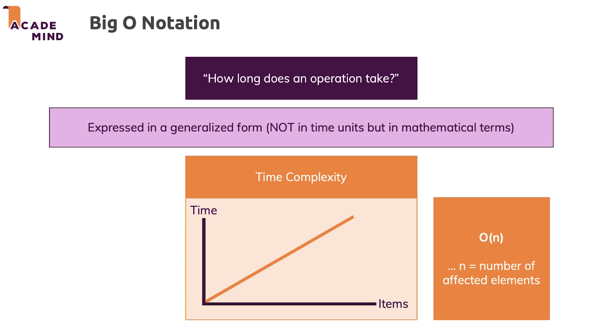

# Data structures and Algorithms
Programming = Algorithms + Data Structures

## Algorithms
<details>
<summary>General info</summary>

- a sequence of steps
- finite, ordered, predictable
- linear - step by step
- logical - on condition
- recursive - iterations of the same action till the certain condition is met
  - every recursive algorithm has a condition
  - must have a closing condition
  - iteration - repetition
  - recursion - self-repetition (everywhere: programming, linguistics, maths, nature)

</details>

<details>
<summary>Performance and The "Big O" notation</summary>

- for comparing different algorithms
- how long does an operation take?
- expressed in a generalized form (not in time units but in mathematical terms)
- time complexity


```JavaScript
// T = 1 + 1 + 1 + 2 + [0 - 2] + 1
// initial stage and result are the same T (constants)
// T = 3 (init) + 2 + [0 - 2] + 1 (return)
// number of elements might be different (n)
// since the initiation of the current min depends on the array
// c2 - constant time of executions inside the for loop
// T = 2 + n * c2 + 1
// the dependance on number of values matters
// T = n => Linear Time Complexity => O(n)
function getMin(numbers) { // [4, 5, -2]
  if (!numbers.length) { // 1 execution
    throw new Error('Should be not an empty array');
  }

  let currentMin = numbers[0]; // 1 execution

  for (let i = 1; i < numbers.length; i++) { // 1 execution
    if (numbers[i] < currentMin) { // 2 executions
      currentMin = numbers[i]; // 0 - 2 executions
    }
  }

  return currentMin; // 1 execution
}

// compare to the other algorithm
// T = n * (n - 1) => Quadratic Time Complexity => O(n^2)
function getMinSorting(numbers) { // [3, 5, 10]
  if (!numbers.length) { // 1 execution
    throw new Error('Should be not an empty array');
  }

  for (let i = 0; i < numbers.length; i++) { // 1 execution
    let outerNumber = numbers[i]; // n executions

    for (let j = i + 1; j < numbers.length; j++) {
      let innerNumber = numbers[j]; // (n - 1) executions

      if (outerNumber > innerNumber) {
        numbers[i] = innerNumber;
        numbers[j] = outerNumber;

        outerNumber = numbers[i];
        innerNumber = numbers[j];
      }
    }
  }

  return numbers[0]; // 1 execution
}
```

</details>

## Data Structures (JS implementation)
<details>
<summary>Lists</summary>

- elements can be repeated
- order matters
- numbered lists
- access via key `list[0]`

</details>

<details>
<summary>Sets</summary>

- order doesn't matter
- unique elements `set.add('item');`
- has no keys
- access via value `set.has('item');`

</details>

<details>
<summary>Dictionaries</summary>

- associative array
- no order, has keys
- unique keys
```JavaScript
const filterValueToScale = {
  'smallest': 0.25,
  'small': 0.5,
  'normal': 1,
  'big': 1.5
};

// if you need to iterate, use Map
const pairs = new Map([
  ['Ron', 'Hermione'],
  ['Harry', 'Ginny']
]);
for (const pair of pairs) {
  console.log(pair); // ['Ron', 'Hermione']
}
```

</details>