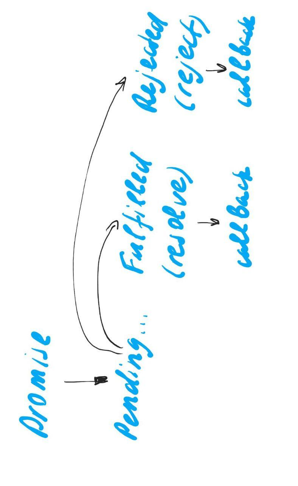
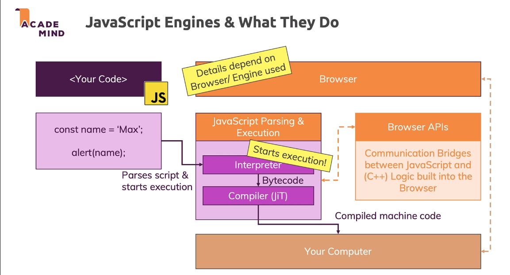
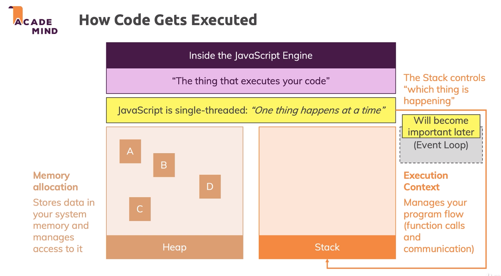

# JavaScript

## Good practices
<details>
<summary>Notes</summary>

- don't pass the reference type, pass the id when possible (primitive value)

</details>

## Code style
<details>
<summary>Tips</summary>

- Semi-colons `;` are placed after every expression except blocks of code `{}` (exceptions are objects and everything declared with `var`, `let` or `const`, basically variables)

</details>

## Constants and variables
<details>
<summary>General info</summary>

- `name = 'Mary';` works (JS adds `var name = Mary;`) but bad practice (not allowed with `'use strict';`)
- `var`
  - hoisting
  - `var i = 21; var i = 45;` recreating
  - function and global scope (but no block scope)
  - `var undefined = 67;` reserved names usage (not allowed with `'use strict;`)
- `let`, `const` - no hoisting, no recreating, block scope, using reserved names is not allowed
```JavaScript
// not any const = constant
// declares a variable with immutable link
const element = document.querySelector('p');
const arr = [1, 2, 3, 4];
```

</details>

<details>
<summary>Declarations (naming conventions)</summary>

- immutable (code agreement: protected, hardcoded) constant primitive value (physical constants, coefficients, etc)
```JavaScript
const LIGHT_SPEED = 255792458;
```
- immutable constant array
```JavaScript
const DEFAULT_NAMES = ['Michael', 'Anna', 'Chris'];
```
- enumeration (immutable constant) is a complete list of constants grouped by some sign
```JavaScript
const Code = {
  SUCCESS: 200,
  CACHED: 302,
  NOT_FOUND: 404,
  SERVER_ERROR: 500
};

const Earth = {
  RADIUS: 6.371,
  GRAVITATION: 6.67408
};
```

</details>

## Data types and structures
<details>
<summary>Available data types</summary>

```JavaScript
// 1 - undefined
console.log(typeof undefined); // => undefined
// 2 - null
console.log(typeof null); // => object
// 3 - Boolean
console.log(typeof false); // => boolean
// 4 - Number
console.log(typeof 10); // => number
// 5 - String
console.log(typeof 'text'); // => string
// 6 - Symbol
console.log(typeof Symbol('sym')); // => symbol
// 7 - Object
// iterable lists: Array
// collections: NodeList, HTMLElementsList, classList, arguments
// iterable dictionaries: Map, WeakMap
// iterable sets: Set, WeakSet
// function is also an object, but of type function
console.log(typeof {}); // => object
console.log(typeof []); // => object
console.log(typeof function() {}); // => function
// 8 - BitInt
console.log(typeof 1n); // => bigint
console.log(typeof BigInt(9)); // => bigint
console.log(typeof BigInt('9')); // => bigint
```

</details>

## Numbers
<details>
<summary>General info</summary>

- every number is a float
- numbers are stored as 64 Bit Floating Points (some issues and limits)
- JS works with binary numbers and converts into decimal
```JavaScript
// infinite number
1 / 0; // => Infinity
// max numbers
Number.MAX_SAFE_INTEGER; // 2^53 - 1
Number.MIN_SAFE_INTEGER; // -(2^53 - 1)
// floats
Number.MAX_VALUE;
// > or < calculations won't work, only display
// if we do such calculations, no errors
// but strange results because of binary system
```

</details>

<details>
<summary>Strange cases</summary>

- because JS works with binary and converts into decimal, there are some strange cases
```JavaScript
0.2 + 0.4 === 0.6; // => false (0.6000...1)
// something similar to 1/3 happens (0.33333(3))
(1).toString(2); // => 1
(5).toString(2); // => 101
(1/5).toString(2); // => 0.001100110011...
(0.2).toString(2); // => 0.001100110011...
0.2; // => 0.2
0.2.toFixed(20); // => 0.2000...1110
```

</details>

<details>
<summary>BidInt</summary>

- to work with > max or < min numbers
- only integer, decimal => error
```JavaScript
// to create add n
9007199254740991985392n;
10n;
// can't mix with numbers
10n - 5; // => error
// but can use like this
10n - 5n; // => 5n
parseInt(10n) - 5; // => 5
10n - BigInt(5); // => 5n
// omits decimal
5n / 2n; // => 2n (not 2.5n)
```

</details>

<details>
<summary>Learn more</summary>

- [ ] [Number on MDN](https://developer.mozilla.org/en-US/docs/Web/JavaScript/Reference/Global_Objects/Number)

</details>

## Strings
<details>
<summary>Methods</summary>

```JavaScript
const playerName = 'Harry Potter';

// case sensitive
console.log(playerName.includes('rr')); // => true
console.log(playerName.includes('h')); // => false
```

</details>

<details>
<summary>How to remove duplicates?</summary>

- easy way is to convert into an array and use `Set`

</details>

## Iterables
<details>
<summary>General info</summary>

- objects that implement the 'iterable' protocol and have an `@@iterator` method (ex `Symbol.iterator`)
- basically objects where you can use `for ... of` loop
- in JS there are many iterables: Array, NodeList, String, Map, Set

</details>

<details>
<summary>Array</summary>

- store data of any kind and length
- has many special methods
- order is guaranteed
- duplicates are allowed
- index-based access

</details>

<details>
<summary>Set</summary>

- store data of any kind and length
- has own special methods
- order is not guaranteed
- duplicates are not allowed
- no index-based access

</details>

<details>
<summary>Map</summary>

- store key-value data of any kind and length
- any key values are allowed
- has own special methods
- order is guaranteed
- duplicate keys are not allowed
- key-based access

</details>

<details>
<summary>Learn more</summary>

- [7 Tips to Handle undefined in JavaScript](https://dmitripavlutin.com/7-tips-to-handle-undefined-in-javascript/)
- [Array vs Set vs Map vs Object — Real-time use cases in Javascript](https://codeburst.io/array-vs-set-vs-map-vs-object-real-time-use-cases-in-javascript-es6-47ee3295329b)
- [Iteration protocols on MDN](https://developer.mozilla.org/en-US/docs/Web/JavaScript/Reference/Iteration_protocols)

</details>

## Iterables: Arrays
<details>
<summary>Creation</summary>

```JavaScript
// before ES6
var numbers = new Array(3, 5); // => [3, 5]
var numbers2 = Array(3, 5);
var emptyArray = new Array(3); // => [] with length === 3
var emptyArray2 = Array(3);
var letters = ['a', 'r']; // => ['a', 'r']

// ES6+
// makes an array of any iterable (collection, separate values)
const elements = Array.from(document.querySelectorAll('li'));
const letters = Array.from('string');
// of separate values
const values = Array.of(1, 2, 3);
const items = [...elements, ...values];
```

</details>

<details>
<summary>Methods</summary>

```JavaScript
const numbers = [1, 2, 5];
const text = 'One two three';

// doesn't change the initial array
numbers.forEach();
// arrays and strings
const words = text.split(' ');
// by default separates with ,
const newText = words.join();
const newText2 = words.join(' ');

// change the initial array
// --- *** ---
// add/remove to the end/last of the array
const newNumbersLength = numbers.push(7, 9);
const removedItem = numbers.pop();
// add/remove first, slower than push and pop
const newNumbersLengthValue = numbers.unshift(9, 12, 15);
const removedItem2 = numbers.shift();
// items in between will be empty of undefined value
numbers[5] = 23;
// --- *** ---
// start index, delete count, value to add (or more 10, 15)
numbers.splice(1, 0, 10); // => [1, 10, 2, 5]
// removes from the end
numbers.splice(-1, 1); // => [1, 2]
// will delete all items starting with the provided index
const removedElements = numbers.splice(0);
// --- *** ---
const reversedNumbers = numbers.reverse();
// --- *** ---
// by default converts to a string and sorts characters
const sortedDefault = numbers.sort();
const sortedNumbers = numbers.sort((a, b) => {
  if (a > b) {
    // or any positive value
    return 1;
  } else if (a === b) {
    return 0;
  } else {
    // or any negative value
    return -1;
  }

  // or
  return a - b;
});

// return new array
// --- *** ---
// copy an array
const clonedNumbers = numbers.slice();
// copy starting from index till the end
const clonedNumbers2 = numbers.slice(2);
// end item not included
const clonedNumbers3 = numbers.slice(0, 2); // => [1, 2]
// [] if nothing is in between
const emptyNumbers = numbers.slice(3, 2);
const emptyNumbers2 = numbers.slice(-3, -4);
// from the end
const clonedPartOfNumbers = numbers.slice(-3, -1); // => [1, 2]
// --- *** ---
// clones array and adds values from another array
const newNumbers = numbers.concat([8, 5, 2]);
// --- *** ---
const filteredNumbers = numbers.filter();
// --- *** ---
const newTransformedNumbers = numbers.map();

// return new something
// --- *** ---
// if several same values => returns the index of the first
const index = numbers.indexOf(5);
// if several same values => returns the index of the last
const lastIndex = numbers.lastIndexOf(5);
// the same numbers.indexOf(5) !== -1
const isNumberInNumbers = numbers.includes(5);
// --- *** ---
const number = numbers.find();
const numberIndex = numbers.findIndex();
// --- *** ---
const sum = numbers.reduce((prevValue, number, index, numbers) => {
  return prevValue + number;
}, 0);
```

</details>

<details>
<summary>Arrays as a stack LIFO</summary>

- for tasks, when we have to store previous item (history, browser history, games)
- also available to 'go forward' the history (have to store the removed action back to the stack)

```JavaScript
const questions = [{
  question: 'Which class has a different teacher every year?',
  answers: [{
    answer: 'Defence against the dark arts',
    isCorrect: true
  }, {
    answer: 'Potions',
    isCorrect: false
  }]
}, {
  question: 'What animal represents Hufflepuff house?',
  answers: [{
    answer: 'The Burrow',
    isCorrect: true
  }, {
    answer: 'The Fox',
    isCorrect: false
  }]
}];

const history = [];

const changeQuestion = (newQuestion) => {
  const oldQuestion = questions[0].question;

  questions[0].question = newQuestion;
  
  // store the action (function) and add to the history array
  // works because of closures
  history.push(() => questions[0].question = oldQuestion;
};

console.log(questions[0].question);
changeQuestion('What was the original question?');
console.log(questions[0].question);
changeQuestion('Who is Harry Potter?');
console.log(questions[0].question);

// to get back the stored value
history.pop()();
console.log(questions[0].question);
history.pop()();
console.log(questions[0].question);
```

</details>

<details>
<summary>Arrays as a queue FIFO</summary>

- for tasks to be executed in a row after some async event
- for unique actions can use `Set` instead of `Array`

```JavaScript
const callbacks = [];

const addAsyncListener = (fn) => {
  // check if the callback exists (used before set was created)
  if (!callbacks.find((it) => it === fn)) {
    callbacks.push(fn);
  }
};

const startAsync = () => {
  setTimeout(() => {
    for (const cb of callbacks) {
      callbacks.delete(cb);
      cb();
    }

    console.log('Done');
  }, 500);
};

const log2 = () => console.log(2);

addAsyncListener(() => console.log(1));
addAsyncListener(log2);
addAsyncListener(log2); // won't be added to array
addAsyncListener(() => console.log(3));

console.log('Start!');
startAsync();

addAsyncListener(() => console.log(4));
addAsyncListener(() => console.log(5));

// the log will be: Start! 1 2 3 4 5 Done
```

</details>

<details>
<summary>Learn more</summary>

- [Array on MDN](https://developer.mozilla.org/en-US/docs/Web/JavaScript/Reference/Global_Objects/Array)
- [Which Array Function When?](https://dev.to/andrew565/which-array-function-when)

</details>

## Iterables: Sets
<details>
<summary>Working with sets</summary>

```JavaScript
const data = new Set();
data.add(1);

// based on array or any other iterable
const data2 = new Set([1, 4, 8]);

const isElementInData = data2.has(1); // => true

// delete not existed item does nothing
data2.delete(1);

// iterable
for (const item of data2) {
  console.log(item);
}

const entries = data2.entries();
for (const entry of entries) {
  console.log(entry); // => [1, 1] => [4, 4] => [8, 8]
}
```

</details>

<details>
<summary>WeakSet</summary>

- less methods available
- have to store objects, not primitives
- that's because JS clears those objects (releases to garbage collection) if you don't work with the certain piece of data anymore
```JavaScript
let user = {name: 'Harry'};
const users = new WeakSet();

users.add(user);

// do some operations with user
// still need the set, but not the user
// JS garbage collector will remove the object
// but if we use the Set(), the object (reference type) will not be removed
// from the Set
user = null;
```

</details>

<details>
<summary>Learn more</summary>

- [Set on MDN](https://developer.mozilla.org/en-US/docs/Web/JavaScript/Reference/Global_Objects/Set)
- [WeakSet on MDN](https://developer.mozilla.org/en-US/docs/Web/JavaScript/Reference/Global_Objects/Weakset)

</details>

## Iterables: Maps
<details>
<summary>Dictionaries - Map</summary>

- any keys possible
- iterable
- pairs are objects
- better performance (than object) for large quantities of data
- better performance when adding / removing data frequently
```JavaScript
let pairs = new Map();

pairs.set('John', 'May');
pairs.set('Ichigo', 'Rukiya');

// or with iterable
let pairs = new Map([['John', 'May'], ['Ichigo', 'Rukiya']]);

// get the value
const pair = pairs.get('John');

// entries
for (const entry of pairs.entries()) {
  console.log(entry); // => ['John', 'May'] => ['Ichigo', 'Rukiya']
}
for (const [key, value] of pairs.entries()) {
  console.log(key, value);
}

// keys
for (const key of pairs.keys()) {
  console.log(key);
}

// values
for (const value of pairs.values()) {
  console.log(value);
}

// iterating
for (const [first, second] of pairs) {
  console.log(first.name + second.name);
}
```

</details>

<details>
<summary>WeakMap</summary>

- less methods available
```JavaScript
let user = {name: 'Harry'};
const users = new WeakMap();

users.set(user, 'Some info');

// do some operations with user
// still need the map, but not the user
// JS garbage collector will remove the object
user = null;
```

</details>

<details>
<summary>Convert object into map</summary>

```JavaScript
const player = {
  name: 'Harry',
  level: 10
};

const playerMap = new Map(Object.entries(player));

const newPlayer = Object.fromEntries(playerMap.entries());
```

</details>

<details>
<summary>Learn more</summary>

- [Map on MDN](https://developer.mozilla.org/en-US/docs/Web/JavaScript/Reference/Global_Objects/Map)
- [WeakMap on MDN](https://developer.mozilla.org/en-US/docs/Web/JavaScript/Reference/Global_Objects/WeakMap)

</details>

## Objects
<details>
<summary>General info</summary>

- keys are strings, numbers (positive int or floats) or symbols (other not possible)
- not iterable (can use `for ... in` old cycle has some issues, not `for ... of`)

</details>

<details>
<summary>As dictionaries</summary>

```JavaScript
const filterValueToScale = {
  'smallest': 0.25,
  'small': 0.5,
  'normal': 1,
  'large': 2
};
```

</details>

<details>
<summary>Creation and accessing</summary>

```JavaScript
// simple object
const person = {
  'short-name': 'Ron',
  age: 22,
  level: 3,
  3.2: 'some value',
  walk: function() {}
};

// collapsed = the object (if not all the keys are numbers) is not sorted
// if numbers = order ascending
// when not collapsed = any object is sorted, numbers first
console.log(person);

console.log(person.age);
console.log(person['short-name']);
console.log(person[3.2]);
console.log(person['3.2']);

// if no property or method => undefined (not an error)
console.log(person.hobbies);

// creation with variable (ES6+)
const name = 'Harry';
const user = {
  name,
  level: 1
};

// complex keys (could be useful for dictionaries) (ES6+)
const potter = 'Harry Potter';
const voldemort = 'Tom Riddle';
const antagonist = {
  [potter]: voldemort,
  ['Sirius Black']: 'Bellatrix Lestrange'
};

// destructuring (ES6+)
const newAntagonist = {...antagonist};

// new syntax for methods (ES6+)
const character = {
  go() {}
};
```

</details>

<details>
<summary>Getters and setters</summary>

```JavaScript
const character = {
  // not necessary to create a property
  // can just omit
  _level: 1,

  // can't use getter/setter + property
  // can't address itself = infinite cycle
  get level() {
    return this._level;
  },
  // always strictly 1 parameter
  set level(value) {
    if (value < 0) {
      this._level = this._level;
      // or set the default value
      // or throw an error
    }
    this._level = value;
  }
};

// addressing the getter or setter
// it there is only setter, can't access the value
const level = character.level;
character.level = 100;
```

</details>

<details>
<summary>Iterating</summary>

```JavaScript
// before ES6
// for ... in
// deprecated
// requires additional check, otherwise can go through the whole prototype chain

// ES6
// for ... of works if using Symbol.iterator protocol
const player = {
  name: 'Harry',
  level: 10
};
// [['name', 'Harry'], ['level', 10]]
const playerEntries = Object.entries(player);
// ['Harry', 10]
const playerValues = Object.values(player);
// ['name', 'level']
const playerKeys = Object.keys(player);
```

</details>

<details>
<summary>Add, modify, delete a property or method</summary>

```JavaScript
const player = {
  name: 'Harry',
  level: 10
};

player.age = 33;
player.level = 20;
delete player.name;
```

</details>

<details>
<summary>Check if property exists</summary>

```JavaScript
// but if the property = undefined, also returns false
player.name !== undefined;
// true even if undefined
'name' in player;
// true even if undefined
player.hasOwnProperty('name');
```

</details>

<details>
<summary>Copy</summary>

- not a deep copy
```JavaScript
// {} - where
// player - what
const newPlayer = Object.assign({}, player);
// for several
const newPlayer = Object.assign({}, player, {options: 'code'});

const newPlayer = {...player};
```
- copying deep - recursive with checking typeof function or object
  - lodash has deep copy
  - also there is hack with json.parse, json.stringify

</details>

<details>
<summary>Object Descriptors</summary>

```JavaScript
const character = {
  name: 'Harry',
  printName: function() {
    console.log(this.name);
  }
};

Object.getOwnPropertyDescriptors(character);
Object.defineProperty(character, 'name', {
  // defaults
  // can delete or define property
  configurable: true,
  // is accessible in for ... in loop
  enumerable: true,
  value: character.name,
  // can rewrite
  writable: true
});

// if writable === false
// no error but won't change, stays the same (Harry)
character.name = 'Ron';

// if configurable === false
// no error but won't delete, stays the same (Harry)
// can't reset configuration also, be careful
delete character.name;

// if enumerable === false
for (const key in character) {
  // will skip the name key, logs only printName
  console.log(key);
}
```

</details>

<details>
<summary>Learn more</summary>

- [ ] [ES6 in Action: Enhanced Object Literals](https://www.sitepoint.com/es6-enhanced-object-literals/)
- [ ] [Objects on MDN](https://developer.mozilla.org/en-US/docs/Learn/JavaScript/Objects)
- [ ] [Object.create on MDN](https://developer.mozilla.org/en-US/docs/Web/JavaScript/Reference/Global_Objects/Object/create)

</details>

## Functions
<details>
<summary>General info</summary>

- function without `return` statement returns `undefined`

</details>

<details>
<summary>Parameters vs Arguments</summary>

- parameters are variables, which are specified when defining a function
```JavaScript
function printMsg(msg) {}
```
- arguments are the concrete values passed to a function when calling it
```JavaScript
printMsg('Some message');
```

</details>

<details>
<summary>Anonymous function</summary>

- when there is an error inside the anonymous function, name of the function will be `<anonymous>`
```JavaScript
button.addEventListener('click', function() {});
```
- the only case why to add a name to anonymous function is for debugging, in that case the name of the function will be specified
```JavaScript
button.addEventListener('click', function onClick() {});
```

</details>

<details>
<summary>Default parameters</summary>

```JavaScript
// Earlier
var doSomething = function (caption, amount, isChecked) {
  if (typeof isChecked === 'undefined') {
    isChecked = false;
  }
};

// ES2015
// even if we explicitly pass instead of isChecked undefined,
// the default value will be assigned
const doSomething = (caption, amount, isChecked = false) => {
  // some code here
};

// can also use the previous parameter in default value assignment
const doSomething = (amount, isChecked = amount > 5 ? true : false) => {};
```

</details>

<details>
<summary>Arrow functions</summary>

- doesn't have it's own scope (only lexical) - when global, `this === window`
- doesn't have `arguments` object
- can't rewrite `this` (`bind` and `call` won't work)
  - can't be used as a constructor, no `new` keyword
  - can't be method of an object or prototype

```JavaScript
// only 1 param?
const doSomething = param => console.log(param);

// only 1 expression?
// = return left * right;
const doSomething = (left, right) => left * right;

// return object?
const getWizard = (name, level) => ({
  name,
  level
});
```

</details>

<details>
<summary>Arguments keyword</summary>

- don't have to pass as a parameter (accessible as a keyword inside any function)
- iterable structure

</details>

<details>
<summary>Bind, call, apply</summary>

- `call` and `apply` call the function (as `()`)
- `bind` doesn't call the function
- the arguments passed after context are preset arguments, when the arguments are passed on function call, append to the end
```JavaScript
const addNumbers = (cb, ...numbers) => {
  // sum numbers
  let result = 100;

  cb(result);
};

const printResult = (text, result) => console.log(`${text} ${result}`);

addNumbers(printResult.bind(this, 'The sum is:'), 10, 90);
```
- more info in [scope](#scope) section

</details>

<details>
<summary>Calling a function with template literals (tagged templates)</summary>

- with tagged template literals the value of the first argument is always an array of the string values, the remaining arguments are of the passed expressions
```JavaScript
const getPlayerInfo = (first, second, third) => {
  console.log(first); // ['', ' is ', ' for now']
  console.log(second); // 'Harry'
  console.log(third); // 10
};

const name = 'Harry';
const level = 10;

getPlayerInfo`${name} is ${level} for now`;
```

</details>

<details>
<summary>Pure functions and side effects</summary>

- for the same input always give the same output
- no side effects
```JavaScript
// pure function
const addNumbers = (num1, num2) => {
  return num1 + num2;
};

// impure - output changes
const addRandomNumber = (num) => {
  return num + Math.random();
};

// impure - side effect
let result = 0;

const addNumber = (num) => {
  result += num;
  return result;
};

// impure - side effect
const books = ['If I Never Met You', 'Atomic Habits'];

const addBook = (book) => {
  books.push(book);
};
```

</details>

<details>
<summary>Factory functions</summary>

- functions which create a function
- good for pre-configuring some values
```JavaScript
// for not to pass the tax rate all the time
const createCalculateTax = (tax) => {
  return (amount) => {
    return amount * tax;
  };
};

const calculateVatAmount = createCalculateTax(0.19);
const calculateIncomeTaxAmount = createCalculateTax(0.25);

console.log(calculateVatAmount(100));
console.log(calculateIncomeTaxAmount(100));
```

</details>

<details>
<summary>Closures</summary>

- all functions in JS are closures
- function locks in all surrounding variables
- mostly used for factory functions

</details>

<details>
<summary>Recursion</summary>

- sometimes it's shorter than other ways
- if too many calls => stack overflow
```JavaScript
const getPower = (a, n) => {
  let result = 1;

  for (let i = 0; i < n; i++) {
    result *= a;
  }

  return result;
};

const getPowerRec = (a, n) => {
  // don't forget to add an exit condition
  if (n === 1) {
    return a;
  }

  return a * getPowerRec(a, n - 1);
};

// even shorter
const getPowerRec = (a, n) => {
  return n === 1 ? a : a * getPowerRec(a, n - 1);
};
```
- where do we need the recursion?
- when there are some nested objects but we don't know exactly how many
```JavaScript
const player = {
  name: 'Harry',
  teamMembers: [{
    name: 'Ron',
    teamMembers: [{
      name: 'Ginny'
    }]
  }, {
    name: 'Hermione',
    teamMembers: [{
      name: 'Luna',
      teamMembers: [{
        name: 'Mary'
      }]
    }]
  }, {
    name: 'Sirius'
  }, {
    name: 'Ellie'
  }]
};

const getTeamMemberNames = (player) => {
  const names = [];

  if (!player.teamMembers) {
    return [];
  }

  for (const teamMember of player.teamMembers) {
    names.push(teamMember.name);
    names.push(...getTeamMemberNames(teamMember));
  }

  return names;
};

console.log(getTeamMemberNames(player));
```

</details>

<details>
<summary>Learn more</summary>

- [Functions on MDN](https://developer.mozilla.org/en-US/docs/Web/JavaScript/Guide/Functions)
- [Bind on MDN](https://developer.mozilla.org/en-US/docs/Web/JavaScript/Reference/Global_objects/Function/bind)
- [Closures on MDN](https://developer.mozilla.org/en-US/docs/Web/JavaScript/Closures)
- [Recursion on MDN](https://developer.mozilla.org/en-US/docs/Web/JavaScript/Guide/Functions#Recursion)
- [ ] [Tagged templates on  MDN](https://developer.mozilla.org/en-US/docs/Web/JavaScript/Reference/Template_literals#Tagged_templates)

</details>

## Scope
<details>
<summary>General info</summary>

- scope where the function runs
- `this` links to current object in a `class`
- in an object (method) `this` = link to the object itself
- `use strict` affects `this` value
  - no `use strict` = `window`, with = `undefined`
- while the function is not called, it doesn't have any context
- context is being created upon the function call
- depends on how the function is called
```JavaScript
// using outer function
const walk = function() {
  console.log(this + 'walk!');
};

const player = {
  name: 'Ron',
  walk
};

// this links to player object
player.walk();
// TypeError: Cannot read property '...' of undefined
walk();
```
```JavaScript
// with destructuring
const player = {
  name: 'Harry',
  age: 28,
  run() {
    console.log(this + ' runs!');
  }
};

const { run } = player;
// TypeError: Cannot read property '...' of undefined
run();
```
- with closure the result is more obvious
```JavaScript
const guitarPlayer = {
  firstName: 'Michael',
  lastName: 'Lantsov',
  play() {
    console.log(`${guitarPlayer.firstName} ${guitarPlayer.lastName}`);
  }
};

const anotherPlayer = {
  firstName: 'Anna',
  lastName: 'Starkov'
  play: guitarPlayer.play
};

// output will be the same
guitarPlayer.play();
anotherPlayer.play();
```
- could be changed, also with `apply`, `call`, `bind`
- if we use `new` keyword to create an instance, lexical `this` will be the object (binds `this` in the constructor)

</details>

<details>
<summary>Using array methods inside the object methods</summary>

```JavaScript
const players = {
  team: 'Griffindor',
  members: ['Harry', 'Ron', 'Hermione'],
  getMembers() {
    this.members.forEach(function(member) {
      // here this is created when the forEach calls it
      // it is called not on players object
      // so this here === global scope or undefined
      // could be solved with arrow function
      console.log(this);
    });
  }
};
```

</details>

<details>
<summary>Bind, call and apply</summary>

- `bind` creates a new function, the initial function stays the same
- `bind` context can't be changed even with `apply`, `call`
```JavaScript
// here `this === obj` instead of `a` (respects the first binding)
obj.getThis4 = obj.getThis2.bind(obj);
obj.getThis4.call(a);
```
- calling a function with bound context (1st param in those functions is always context, the 2nd parameter differs)
```JavaScript
// arguments separated with ',' will be function params
// perfect when there are not many params
play.call(anotherPlayer, '20.02.1967');
// array, which values will be function params
// good for many params or undefined number of params
play.apply(guitarPlayer, ['20.02.1967']);
```
```JavaScript
const numbers = [1, 3, 100, 5];

// we don't need context here, so pass 'null'
console.log(Math.max.apply(null, numbers));
```

</details>

<details>
<summary>Event listeners and scope</summary>

- listener's context is always === the element, to which the listener is applied `document.body` or `evt.currentTarget` (the browser binds `this` (on event listeners) to the DOM element that triggered the event)
```JavaScript
// even in this case
const cart = {
  item: 'Book',
  price: 6,
  print() {
    console.log(`${this.item} \$${this.price}`)
  }
};

item.addEventListener('click', cart.print);
// browser will store the function
item.callback = cart.print;
// and executes the callback
// so just won't work (because it's not cart.callback(), but callback())
item.callback();
```
- can override if create the event handler and execute the method
```JavaScript
item.addEventListener('click', function() {
  cart.print();
});
```
- with bind (but careful, `bind` returns a new function, store first in a separate variable to unsubscribe if needed)
```JavaScript
// can't remove the listener
item.addEventListener('click', cart.print.bind(cart));

// to remove a listener
const printCart = cart.print.bind(cart);

item.addEventListener('click', printCart);
item.removeEventListener('click', printCart);
```
```JavaScript
// custom binder (like the bind works)
const customBind = function(fn, context) {
  return function() {
    return fn.apply(context, arguments);
  };
};
```

</details>

<details>
<summary>Arrow functions and scope</summary>

- arrow functions do not have their own context (even when we use `call`, `apply` or `bind`)
- arrow functions passed as a callback to event listeners also have no context
- even with strict mode `this` won't be undefined but referred to the global scope (arrow functions do not have `this` property)
- arrow functions **NEVER** have their own context
```JavaScript
const players = {
  team: 'Griffindor',
  members: ['Harry', 'Ron', 'Hermione'],
  getMembers() {
    this.members.forEach((member) => {
      // works fine because arrow function
      // doesn't bind this
      // so this is the same as in getMembers function
      console.log(member, this.team);
    });
  }
};

players.getMembers();
```

</details>

<details>
<summary>Learn more</summary>

- [this on MDN](https://developer.mozilla.org/en-US/docs/Web/JavaScript/Reference/Operators/this)
- [What is `this`? The Inner Workings of JavaScript Objects](https://medium.com/javascript-scene/what-is-this-the-inner-workings-of-javascript-objects-d397bfa0708a)

</details>

## Constructors and prototypes
<details>
<summary>Prototypes</summary>

- base `Object` doesn't have a prototype (`__proto__`)
- constructor prototype is assigned to instance upon creation
- `prototype` property exists only on function object
- prototype chain under the hood
```JavaScript
const Player = function(firstName, lastName) {
  this.firstName = firstName;
  this.lastName = lastName;
};

// == extends in classes
Player.prototype.play = function() {};

const harryPotter = new Player('Harry', 'Potter');
const ronWeasley = new harryPotter.__proto__.constructor('Ron', 'Weasley');
// first looks inside the Player
// than in Player prototype (harryPotter.__proto__.play())
harryPotter.play();
console.log(harryPotter.__proto__ === Player.prototype); // => true
// than in the Player's prototype's prototype
// till it reaches the Object.prototype
// harryPotter.__proto__.__proto__.toString();
harryPotter.toString();
```

</details>

<details>
<summary>Create a constructor function</summary>

- naming `Player`
- creation of an instance with `new` keyword
- add a method to the prototype
```JavaScript
const Player = function(firstName, lastName) {
  this.firstName = firstName;
  this.lastName = lastName;
};

// to add a static method
Player.describe = function() {
  console.log('Creating players.');
};

// __proto__: { play: function() {} }
Player.prototype.play = function() {};

// will add method to object Player
// available Player.play() only
// if called on instance = TypeError
Player.play = function() {};

const harryPotter = new Player('Harry', 'Potter');
```

</details>

<details>
<summary>New keyword</summary>

- what `new` does?
```JavaScript
const Player = function(firstName, lastName) {
  // new 'creates' this as an object
  this = {};
  // adds properties and methods
  this.firstName = firstName;
  this.lastName = lastName;
  this.greet = function() {
    console.log(`Hello! I'm ${this.firstName} ${this.lastName}`);
  };
  // returns the object
  return this;
};
```
- without `new` => `undefined` (void = return undefined) will not be created
```JavaScript
const ron = Player('Ron', 'Weasley'); // undefined, not created
```
- ES6 check if `new` is used to create an instance
```JavaScript
const Player = function(firstName, lastName) {
  if (!new.target) { 
    throw new Error('Should be called with new operator.'); 
  }
};
```
- check the constructor with `instanceof`
```JavaScript
console.log(harryPotter instanceof Player); // => true
```
- why `new` if we can return an object?
  - `instanceof` becomes useless
  - inheritance (prototype) won't work
- `new` keyword doesn't call the function, it creates an object with it's fields (when we use `this.name = name`)
  - JS gives the information to an object created with `new Player` on what constructor was used to create it
- if you try to imitate a constructor and `return this;`, `this` would be a global object

</details>

<details>
<summary>Learn more</summary>

- [Prototypal Object-Oriented Programming using JavaScript](https://alistapart.com/article/prototypal-object-oriented-programming-using-javascript/)
- [Inheritance in JavaScript on MDN](https://developer.mozilla.org/en-US/docs/Learn/JavaScript/Objects/Inheritance)

</details>

## Classes
<details>
<summary>Creation</summary>

- `class` better than `const` when creating a class
- properties and fields are basically the same thing
```JavaScript
class Player {
  // fields (still poor support)
  // for now use methods only
  // and add all the properties inside of constructor
  level = 2;

  // is optional
  // helps to create an instance of a class
  // all properties are defined here
  constructor(name) {
    // properties
    this.name = name;
    this.onButtonClickArrowFn = () => {
      // this === current instance of a class
      console.log(this);
    };
  }

  onButtonClick() {
    console.log(this);
  }

  // methods are still inside prototype
  play() {
    // this === button
    button.addEventListener('click', this.onButtonClick);
    // this === current instance of a class
    button.addEventListener('click', this.onButtonClick.bind(this));
    button.addEventListener('click', () => this.onButtonClick());
    button.addEventListener('click', this.onButtonClickArrowFn);
  }
}

// don't create classes like this
const Singer = class {};
```
- `new` for creating an instance (or type error)
```JavaScript
const player = new Player('Harry');
```
- `undefined` if try to access the property/field, which is not in the class
- getters / setters can be used
- private fields, soon to use `this.#skill = value;`

</details>

<details>
<summary>Classes under the hood</summary>

```JavaScript
class Person {}

class Player extends Person {
  name = 'Harry';

  constructor() {
    super();
    this.age = 33;
    // if created like this => part of any instance (like a property)
    this.play = function() {};
  }

  // methods are added to prototype
  greet() {
    console.log(`Hi! My name is ${this.name}.`);
  }

  // if created like this => part of any instance (like a property)
  play = function() {};
  // if we use an arrow function here, context will stay the same
  // even when added as an event handler (don't have to bind)
  play = () => {};
}
```

</details>

<details>
<summary>Static properties, fields and methods</summary>

- properties can also be static (but still poor browser support)
- not inherited, accessible on a class without instantiation
```JavaScript
class Player {
  constructor(level, weaponsCount) {
    this.level = level;
    this.weaponsCount = weapons;
  }

  static createJuniorPlayer() {
    return new this(5, 2);
  }
}

const juniorPlayer = Player.createJuniorPlayer();
```

</details>

<details>
<summary>Difference between class and constructor functions</summary>

- `class` can't be used without `new` (could be imitated inside the constructor function with `target.new`)
- class methods are not iterable
```JavaScript
for (const prop in player) {
  console.log(prop);
}
```

</details>

<details>
<summary>Learn more</summary>

- [ ] [OOP notes](./oop.md)
- [ ] [Classes on MDN](https://developer.mozilla.org/en-US/docs/Web/JavaScript/Reference/Classes)
- [ ] [ES6 Classes in Depth](https://ponyfoo.com/articles/es6-classes-in-depth)

</details>

## Expressions, Control structures and Operators
<details>
<summary>Basic operators</summary>

- `=`
- `+` or `+=`
- `-` or `-=`
- `*` or `*=`
- `/` or `/=`
- `%`
- `**` exponentiation operator (not supported in IE)

</details>

<details>
<summary>Increment and decrement</summary>

- `return result++;` returns first the result and then increments
- `return --result;` decrements and then returns the changed value

</details>

<details>
<summary>Conditions and boolean operators</summary>

- `if ... else`
  - returns no value
- `? :`
  - always returns a value
- `switch () { case: ... }`
  - always uses `===` to compare
- falsy values
  - `0`
  - `''`
  - `NaN`
  - `null`
  - `undefined`
- truthy values
  - numbers `!== 0`
  - not empty strings
  - `[]`, `{}` and all other objects and arrays

<hr>

- `==` and `===`
- `!=` and `!==`
- `>` and `<`
```JavaScript
// JS compares strings based on standard lexicographical ordering (Unicode)
console.log('b' > 'a'); // => true

// JS always looks at the first char and only considers other chars if the 1st
// chars are the same
console.log('ab' > 'aa'); // => true

// uppercase chars are smaller than lowercase
console.log('a' > 'B'); // => true
```
- `>=` and `<=`
- `!`
  - `!!userName` converts into a boolean

<hr>

- `a && b` if both are true `=== true`
```JavaScript

// use value if the condition is true
const isLoggedIn = true; // if false => false
const userName = isLoggedIn && 'Mary'; // => 'Mary'

// returns the 1st falsy value
const useName = null && 'Mary'; // => null

// if both truthy, the second is returned
const userName = 'Max' && 'Mary'; // => 'Mary'

```
- `a || b` if at least one is true `=== true`
```JavaScript
// default value assignment
// doesn't convert into a boolean
// returns 1st truthy value
const userName = '' || 'Mary'; // => 'Mary'
const userName = 'Max' || 'Mary'; // => 'Max'

// if both falsy, the second value is returned
const userName = null || ''; // => ''
```
- `&&` precedence is higher than `||`

<hr>

- `isNaN()` to check if NaN or not

<hr>

- `isNaN(value) || value <= 0` if the first part is `true`, JS doesn't go further

</details>

<details>
<summary>Destructuring: Arrays and alike</summary>

- for iterable structures only (doesn't work on strings!)
- all the elements go in an order, can't address the last one

```JavaScript
const numbers = [1, 2, 3, 4, 5];
// before 
const first = numbers[0];
const third = numbers[2];
// with destructuring
const [first, , third] = numbers;
// when there is no value, can use defaults
const [first, , , , , sixth = 45] = numbers;
// when we want specific values and an array of the rest
const [first, ...otherNumbers] = numbers;
// good for swapping the values
let first = 'Harry';
let second = 'Ron';
[first, second] = [second, first];
// can destruct the function result
const [first, , third] = getNumbers();
// or function parameters
const printValues = ([first = 4, , third = 7]) => {
  console.log(`${first} ${third}`);
};
printValues(document.querySelectorAll('li'));
printValues([1, 2]);
printValues([]);
printValues(); // error: undefined is not iterable
```

</details>

<details>
<summary>Destructuring: Objects</summary>

```JavaScript
const cat = {
  name: 'Mini',
  location: 'London',
  color: 'Auburn',
  address: {
    street: 'Some street'
  },
  'home city': 'London'
};
// propOfAnObject: varName = default
const {name: catName, color: catColor = 'White'} = cat;
// with folded objects
const {address: {street: catStreet}} = cat;
// for combined prop use quotes
const {'home city': catCity} = cat;
// creates name and object of remained properties
const {name, ...otherProperties} = cat;

// great to use for DOM nodes
const elements = document.querySelectorAll('li');
for (let i = 0; i < elements.length; i++) {
  const {textContent: text} = elements[i];
  console.log(text);
}

// can combine [] and {} destructuring
const [, {textContent: text}] = document.querySelectorAll('li');
```

</details>

<details>
<summary>Loops</summary>

- in most cases loop is more efficient than a recursion (call stack overflow)
- any recursion could be rewritten into a loop
- `for (let i = 0; i < 5; i++) {}`
- `for (const item of items) {}`
  - almost the same as `for` loop
  - can use `break` and `continue`
  - could be used with every iterable (not only `Array`)
- `for (const key in someObject) {}`
  - requires additional check, otherwise can go through the whole prototype chain
- `while (isEdit) {}` as long as the condition is true
- `do { ... } while (isEdit);` runs at least once

<hr>

- `break;` stops the loop execution
  - if inside the nested loop - stops only the nested one, outer continues
- `continue;` skips only the current iteration and moves to the next

<hr>

- labeled statements could be used with any expression but mostly used with loops
- to break or continue the outer loop from inner
```JavaScript
outerLoop: for (const item of items) {
  console.log('Outer', item);

  innerLoop: for (let i = 0; i < 5; i++) {
    if (i === 2) {
      break outerLoop;
      // or
      continue outerLoop;
    }

    console.log('Inner', i);
  }
}

// could also break from somewhere else in the code
const button = document.querySelector('.button');

button.addEventListener('click', () => {
  break outerLoop;
  // or
  continue outerLoop;
});
```

</details>

<details>
<summary>Rest and spread operators</summary>

- rest collects several values into one iterable structure
- rest must be last parameter in the function (or error)
```JavaScript
// before
function doSomething() {
  return Array.from(arguments);
}
// with rest
const doSomething = (...values) => {
  return values;
};
// destructuring + rest = first and an array of others
const [first, ...others] = doSomething();
```

```JavaScript
// spread - any iterable into separate values
// before
const values = [1, 2, 40, 73, 5];
// find max
Math.max.apply(null, values);
// merge arrays
const newValues = [];
newValues.concat(values);

// with spread
// find max
Math.max(...values);
// merge arrays
const newValues = [...values];
const filteredValues = [...values].filter();
```

</details>

<details>
<summary>Try catch finally</summary>

- `throw { message: 'some message' };` can throw anything as an error, not only `new Error()`
- use `try {} catch (error) {}` only for the code you can't control (ex: server errors, user input)
- `try ... catch` or `try ... finally` but never `catch ... finally`
- if `try` doesn't throw an error, `catch` won't be executed
- why `finally`?
  - when we want to throw the error from inside the `catch` block to send to some statistics etc
  - some cleanup work (release data, clear the variables, etc)
- if the error is thrown from `catch`, only finally executes, code after `try ... catch ... finally` block won't be executed
- `finally` always runs

```JavaScript
function doSomething() {
  try {
    console.log(0); // => 0
    throw 'error ocurred';
  } catch(error) {
    // error => 'error ocurred' (what was used with 'throw')
    console.log(1); // => 1
    // this return statement is suspended till finally block completes
    return true;
    // not reachable
    console.log(2);
  } finally {
    console.log(3); // => 3
    // overwrites the return from catch block
    // function returns this value
    return false;
    // not reachable
    console.log(4);
  }
  // the function returns false from finally block
  // not reachable 
  console.log(5);
}

console.log(doSomething()); // => 0, 1, 3, false
```

</details>

<details>
<summary>Learn more</summary>

- [Operator precedence](https://developer.mozilla.org/en-US/docs/Web/JavaScript/Reference/Operators/Operator_Precedence)
- [Control flow and error handling](https://developer.mozilla.org/en-US/docs/Web/JavaScript/Guide/Control_flow_and_error_handling)
- [Loops and iteration](https://developer.mozilla.org/en-US/docs/Web/JavaScript/Guide/Loops_and_iteration)
- [For ... of on MDN](https://developer.mozilla.org/en-US/docs/Web/JavaScript/Reference/Statements/for...of)
- [Rest on MDN](https://developer.mozilla.org/en-US/docs/Web/JavaScript/Reference/Functions/rest_parameters)
- [Spread on MDN](https://developer.mozilla.org/en-US/docs/Web/JavaScript/Reference/Operators/Spread_syntax)
- [Destructuring on MDN](https://developer.mozilla.org/en-US/docs/Web/JavaScript/Reference/Operators/Destructuring_assignment)

</details>

## Modules
<details>
<summary>Tasks to solve</summary>

- Namespace
  - no global scope
  - encapsulation
- Dependencies
  - easy to follow on what modules depends on
- Interface
  - methods and props export, easy to navigate

</details>

<details>
<summary>Before ES6</summary>

- manual configuration
- have to remember dependencies order
- is not clear, what dependencies are used

```JavaScript
// IIFE
'use strict';
// slider.js
(function() {
  window.slider = {
    name: 'Eve'
  };
})();
```

- better module approaches were found (AMD, CommonJS, UMD)

</details>

<details>
<summary>ES6 exports and imports</summary>

- `'use strict;'` by default
- syntax looks like destructuring, but not the same
- imported variable is not created (exported and imported the created inside the module variable), the same as in export
- better export const or class (if you export let, can't reassign in the other module anyway)
- import without variable when just need to execute the code
- do not fold `export` and `import` into code blocks `{}`
- no hoisting, so that's why `import` is always on top
- `import` of inexistent variable = error, module won't get loaded
- there are dynamic imports, but browser support is still pretty poor
- even when you import the same module several times, browser loads only once
```JavaScript
// module-name.js
// named - names should be the same (or error, module won't get loaded)
// could import not all the export
// can't export the same variable 2x
// better not to combine inline and group exports
export { name, age };
// or
export const name = 'Max';
export const age = 40;
// renamed
export { name as userName };
// default
// better for classes
// could be hard to debug (imported by any name)
export default name;
export default { name };
export { name as default };

// other-module.js
// import using the same variable name
import { name } from './module-name.js';
// import all as child (ignores default, insecure, have no control on import)
import * as child from './module-name.js';
// renamed
import { name as userName } from './module-name.js';
// default
import name from './module-name.js';
import { default as name } from './module-name.js';
// import without a variable if we only need to execute the code from module
import './log.js';
```

</details>

<details>
<summary>Import paths</summary>

- both `''` and `""` available
- path is an immutable constant, can't generate the path
- if 2 same imports => browser downloads only one
- paths abs or rel
  - `https://google.com` url
  - `/utils/helpers.js` abs domain-name
  - `./helpers.js` rel
  - `../helpers.js` rel
- `helpers.js` or `utils/helpers.js` is not supported (reserved for libs from package managers)
- if there is an error while downloading the module or its children => all connected modules won't get loaded

</details>

<details>
<summary>Module loaders</summary>

- browsers: ES modules in browsers
```HTML
<!-- adding modules to the page -->
<!-- by default works like defer -->
<script type="module">
  // some code here
</script>
<script src="module-1.js" type="module"></script>
<!-- fallbacks (ignored by browsers, which support modules) -->
<script src="module-1.js" nomodule></script>
```
- static: webpack, rollupJS, parcel, ...
- orders files
- downloads, stores files
- builds, minifies, packs
- all dependencies are loaded relatively to the 1st loaded module
- browser cashes not only a file, but also the result of executing the module + returned values

</details>

<details>
<summary>Proxy</summary>

```JavaScript
// module-1.js
export { name as nameOne };

// module-2.js
export { name as nameTwo };

// module-3.js
export * from './module-1.js';
export * from './module-2.js';

// module-target.js
import { nameOne, nameTwo } from './module-3.js';
```

</details>

<details>
<summary>Learn more</summary>

- [IIFE](http://benalman.com/news/2010/11/immediately-invoked-function-expression/)
- [What is AMD, CommonJS, and UMD?](https://www.davidbcalhoun.com/2014/what-is-amd-commonjs-and-umd/)
- [AMD](https://github.com/amdjs/amdjs-api/wiki/AMD)
- [Common.js](http://www.commonjs.org/)
- [UMD](https://github.com/umdjs/umd)
- [ECMAScript modules in browsers](https://jakearchibald.com/2017/es-modules-in-browsers/)
- [ES6 In Depth: Modules](https://hacks.mozilla.org/2015/08/es6-in-depth-modules/)
- [ES6 Modules in Depth](https://ponyfoo.com/articles/es6-modules-in-depth)
- [import on MDN](https://developer.mozilla.org/en-US/docs/Web/JavaScript/Reference/Statements/import)
- [export on MDN](https://developer.mozilla.org/en-US/docs/Web/JavaScript/Reference/Statements/export)
- [Exploring ES6 - 16. Modules](https://exploringjs.com/es6/ch_modules.html)

</details>

## Window Object
<details>
<summary>General info</summary>

- browser API, contains all the global properties and methods
```JavaScript
// can call both ways
alert('Say something');
window.alert('Say something');
```

</details>

<details>
<summary>Learn more</summary>

- [ ] [Window on MDN](https://developer.mozilla.org/en-US/docs/Web/API/Window)

</details>

## DOM
<details>
<summary>General info</summary>

- a part of `window` object
- browser searches DOM in depths, so that the first tag is being found (otherwise not obvious)

</details>

<details>
<summary>Selecting Elements</summary>

- query methods
- if no matching => `null` for single or empty collection
```JavaScript
// any css selector
// returns first matching element in the DOM
document.querySelector('ul li:last-child');
// any css selector
// returns NodeList - static collection (snapshot)
// DOM changes doesn't affect 
// (nodes, not only DOM elements, also text, spaces, etc)
document.querySelectorAll('li');

// all those methods could be called only on document, not on element
document.getElementById('title');
// return HTMLCollection - live collection
document.getElementsByClassName('class');
document.getElementsByTagName('li');
```
- parents, children, descendants, ancestors
```JavaScript
const element = document.querySelector('ul');

// parent node (any parent node: element, text etc)
// but in many cases work the same
element.parentNode;
// selects document
document.documentElement.parentNode;
// parent html element
element.parentElement;
// returns null
element.documentElement.parentElement;
// ancestor
element.closest('selector');

// child nodes (any: element, text etc)
element.childNodes;
// returns HTMLCollection - live collection (only DOM elements)
element.children;
// descendant, and other select methods
element.querySelector('selector');
// first or last child node
element.firstChild;
element.lastChild;
// first or last child html element
element.firstElementChild;
element.lastElementChild;

// siblings
element.previousSibling;
element.previousElementSibling;
element.nextSibling;
element.nextElementSibling;
```
- special properties
```JavaScript
// to select the <html>
document.documentElement;
// to select the <body>
document.body;
// to select the <head>
document.head;
```

</details>

<details>
<summary>Attributes and properties</summary>

```JavaScript
const input = document.querySelector('input');

// UI changes but value html attribute stays the same
// classes, ids etc do change the html attribute
input.value = 'Some new text';
// UI stays the same but value attribute changes
input.setAttribute('value', 'Other text');
```
- data attributes
```JavaScript
// html attribute data-cat-name="Cat" can be accessed
const catName = element.dataset.catName;
```

</details>

<details>
<summary>Insert DOM elements and nodes</summary>

- HTML string or text
```JavaScript
const element = document.querySelector('section');
// replace all the content inside the element
element.innerHTML = '<p>Description</p>';
// add html to a specific position
element.insertAdjacentHTML('beforeend', '<p>Description</p>');

// text
element.textContent++;
// is the same
element.textContent = element.textContent++;
```
- Create an element
```JavaScript
const element = document.querySelector('section');
const newElement = document.createElement('p');

newElement.textContent = 'Description';

// all these methods remove the element (if existed)
// and move to the new position
// (need to clone not to be removed)
// append new DOM element or node
// any node, several nodes (IE not supported)
element.append('Some text', newElement);
// first inside the element
element.prepend(newElement);
// before the element (as sibling) (problems with Safari)
element.before(newElement);
// after the element (as sibling) (problems with Safari)
element.after(newElement);
// replace existing DOM element or node with a new one
element.replaceWith(newElement);

// only one element (older methods, have IE support)
// = append();
element.appendChild(newElement);
// = before();
insertBefore();
// = replaceWith();
replaceChild();

// alternative method (supports IE, Safari)
element.insertAdjacentElement('beforeend', newElement);
```

</details>

<details>
</summary>Cloning DOM Nodes</summary>

- better to pass an argument (default could be different for some browsers)
```JavaScript
// deep? boolean
const newElement = element.cloneNode(true);
```

</details>

<details>
<summary>Removing elements</summary>

- when the element is deleted (no reference left), all the listeners are also cleaned up - no memory leaks
```JavaScript
const element = document.querySelector('p');

element.innerHTML = '';
// IE is not supported
element.remove();
// works with IE
element.parentElement.removeChild(element);
```

</details>

<details>
<summary>Dataset attributes</summary>

- works great for tooltips

</details>

<details>
<summary>Working with styles in JS</summary>

- `style` to get styles but only the inline styles
```JavaScript
const element = document.querySelector('p');

// for CSS properties in several words camelCase is used in JS
element.style.backgroundColor = 'green';
element.style['backgroundColor'] = 'green';
element.style['background-color'] = 'green';
```
- `window.getComputedStyle` to get all styles applied to the element

</details>

<details>
<summary>Element coordinates and measurements</summary>

- always relative to the start of the document, not the viewport (doesn't change upon scrolling)
```JavaScript
// readonly property
const topPosition = element.offsetTop;
```
- inner coordinates of the element not including the border, rounds the value to an integer
```JavaScript
// readonly integer property
const innerTop = element.clientTop;
const innerLeft = element.clientLeft;
```
- height of an element's content (including the content not visible on the screen due to overflow)
```JavaScript
// readonly property
const elementFullHeight = element.scrollHeight;
```
- window width and height in pixels
```JavaScript
// readonly properties
const viewportWidthWithScroll = window.innerWidth;
const viewportHeightWithScroll = window.innerHeight;

// real available window sizes not including the scroll
const viewportWidth = document.documentElement.clientWidth;
const viewportHeight = document.documentElement.clientHeight;
```

</details>

<details>
<summary>Scrolling</summary>

```JavaScript
element.scrollIntoView();
```

</details>

<details>
<summary>Templates</summary>

- `importNode` (learn more)

</details>

<details>
<summary>Learn more</summary>

- [Introduction to the DOM](https://developer.mozilla.org/en-US/docs/Web/API/Document_Object_Model/Introduction)
- [querySelector on MDN](https://developer.mozilla.org/en-US/docs/Web/API/Document/querySelector)
- [querySelectorAll on MDN](https://developer.mozilla.org/en-US/docs/Web/API/Document/querySelectorAll)
- [getElementById on MDN](https://developer.mozilla.org/en-US/docs/Web/API/Document/getElementById)
- [getElementsByClassName on MDN](https://developer.mozilla.org/en-US/docs/Web/API/Document/getElementsByClassName)
- [getElementsByTagName on MDN](https://developer.mozilla.org/en-US/docs/Web/API/Element/getElementsByTagName)
- [getElementsByName on MDN](https://developer.mozilla.org/en-US/docs/Web/API/Document/getElementsByName)
- [insertAdjacentHTML on MDN](https://developer.mozilla.org/en-US/docs/Web/API/Element/insertAdjacentHTML)
- [append on MDN](https://developer.mozilla.org/en-US/docs/Web/API/ParentNode/append)
- [appendChild on MDN](https://developer.mozilla.org/en-US/docs/Web/API/Node/appendChild)
- [prepend on MDN](https://developer.mozilla.org/en-US/docs/Web/API/ParentNode/prepend)
- [insertBefore on MDN](https://developer.mozilla.org/en-US/docs/Web/API/Node/insertBefore)
- [before on MDN](https://developer.mozilla.org/en-US/docs/Web/API/ChildNode/before)
- [after on MDN](https://developer.mozilla.org/en-US/docs/Web/API/ChildNode/after)
- [insertAdjacentElement on MDN](https://developer.mozilla.org/en-US/docs/Web/API/Element/insertAdjacentElement)
- [replaceWith on MDN](https://developer.mozilla.org/en-US/docs/Web/API/ChildNode/replaceWith)
- [replaceChild on MDN](https://developer.mozilla.org/en-US/docs/Web/API/Node/replaceChild)
- [remove on MDN](https://developer.mozilla.org/en-US/docs/Web/API/ChildNode/remove)
- [removeChild on MDN](https://developer.mozilla.org/en-US/docs/Web/API/Node/removeChild)
- [getBoundingClientRect on MDN](https://developer.mozilla.org/en-US/docs/Web/API/Element/getBoundingClientRect)

</details>

## Events
<details>
<summary>General info</summary>

- made with `Event` constructor
- has specific constructors inherited from `Event` (ex `MouseEvent`, `DragEvent`)
- can be added to any element (even div)
- event listeners are removed when there is no reference to the element left (either in code or DOM)

</details>

<details>
<summary>Usage</summary>

- `onclick` attribute or adding via JS `element.onclick = console.log();` overrides previous handler (can't add 2 handlers)
- the best way to add events is `element.addEventListener();`

</details>

<details>
<summary>Difference between `change` and `input`</summary>

- `change` works when `field.value` changed and the user finished to enter the value (moved the handle and released)
- `input` works with every value change

</details>

<details>
<summary>Scroll event</summary>

- useful for infinite loading
```JavaScript
let currentElementNumber = 0;

const onScroll = () => {
  // measure the distance between our viewport (top left corner)
  // and the end of the page (not viewport)
  const distanceToBottom = document.body.getBoundingClientRect().bottom;
  const viewportHeight = document.documentElement.clientHeight;

  // compare to the window height + threshold
  // if we have < 100px to the end of the content,
  // append new data
  if (distanceToBottom < viewportHeight + 100) {
    const newElement = document.createElement('div');

    currentElementNumber++;
    newElement.innerHTML = `<p>Add element ${currentElementNumber}</p>`;
    document.body.append(newElement);
  }
};

window.addEventListener('scroll', onScroll);
```

</details>

<details>
<summary>Bubbling and capturing</summary>

- (1) capturing (out - in) => (2) bubbling (in - out)
- `addEventListener` by default registers event in a bubbling phase (when we have a listener on button and it's wrapper, first fires button, second wrapper)
- third parameter of `addEventListener(, , true);` switches to the capturing phase (can add to only one listener in a chain)
- to prevent propagation
```JavaScript
evt.stopPropagation();
evt.stopImmediatePropagation();
```

</details>

<details>
<summary>Event delegation</summary>

- `event.target` is referred to the actual item triggered the event
- `event.currentTarget` always referred to the element, where the listener is added
- `event.target.closest('li');` can also get the item itself

</details>

<details>
<summary>Triggering DOM events programmatically</summary>

```JavaScript
// if triggered like that, the event listener added
// is skipped (won't get executed)
// but triggering click event on submit button will work
form.submit();
// works with added listeners
button.click();
```

</details>

<details>
<summary>This keyword inside the handler</summary>

- with arrow functions as handlers `this === window`
- with regular function as handler `this === evt.currentTarget`

</details>

<details>
<summary>Drag & Drop</summary>

1. set attribute to `draggable="true"`
2. listen to `dragstart` event (describe the operation and append some data here)
```JavaScript
elementToDrag.addEventListener('dragstart', evt => {
  evt.dataTransfer.setData('text/plain', id);
  evt.dataTransfer.effectAllowed = 'move';
});
```
3. allow to drop into the droppable area (add `preventDefault()` to `dragenter` and `dragover` events)
```JavaScript
// if in drop area we won't prevent default,
// drop event won't be triggered
containerDroppable.addEventListener('dragenter', evt => {
  // can get the data type
  // but not the actual data
  if (evt.dataTransfer.types[0] === 'text/plain') {
    evt.preventDefault();
    // add some visual effect to indicate
    // it's droppable (on dragenter)
    containerDroppable.parentElement.classList.add('droppable');
  }
});

containerDroppable.addEventListener('dragover', evt => {
  if (evt.dataTransfer.types[0] === 'text/plain') {
    evt.preventDefault();
  }
});
```
4. (optional) listen to `dragleave` event (ex. to update some styles)
```JavaScript
containerDroppable.addEventListener('dragleave', evt => {
  // check if only left the element, not just moved
  // to it's children 
  // (w/o this will be triggered when move over the children elements)
  if (evt.relatedTarget.closest('ul') !== containerDroppable) {
    containerDroppable.parentElement.classList.remove('droppable');
  }
});
```
5. listen to `drop` event and update data and UI
```JavaScript
// to react to the drop event need to add a listener
// to the droppable container
containerDroppable.addEventListener('drop', evt => {
  // can get any data we set in dragstart event
  // (now it's available)
  const id = evt.dataTransfer.getData('text/plain');

  // check if the item is in the list and do nothing
  // if not - add item to the list and remove where it was
});
```
6. (optional) listen to `dragend` event and update data and UI (triggered event when the drag was canceled)
```JavaScript
// is added to a draggable element
elementToDrag.addEventListener('dragend', evt => {
  // check if the drag wasn't done
  evt.dataTransfer.dropEffect === 'none';
});
```

</details>

<details>
<summary>Learn more</summary>

- [ ] [Introduction to events on MDN](https://developer.mozilla.org/en-US/docs/Learn/JavaScript/Building_blocks/Events)
- [ ] [Event reference on MDN](https://developer.mozilla.org/en-US/docs/Web/Events)
- [ ] [Event on MDN](https://developer.mozilla.org/en-US/docs/Web/API/Event)
- [ ] [Drag and drop API on MDN](https://developer.mozilla.org/en-US/docs/Web/API/HTML_Drag_and_Drop_API)

</details>

## Timers and intervals

## Async JavaScript (promises and callbacks, async/await), http requests
<details>
<summary>Sync data loading</summary>

```JavaScript
const getResponse = (url) => {
    const xhr = new XMLHttpRequest();
    xhr.open('GET', url, false);
    xhr.send();
    // we can do it like that, because it's a sync request
    // return will happen after we get the response
    return xhr.response;
};
const data = getResponse('https://data.com/users');
```

</details>

<details>
<summary>Event loop</summary>

- JS is single threaded
- browser is multi threaded
- all kind of async tasks (like timers, event listeners, etc) are going to browser (message queue)
- when the call stack is empty, event loop goes through message queue
- and executes the functions from there

</details>
  
<details>
<summary>Async ES5 (callbacks)</summary>

- async - run the operation without blocking the main script process
- complex interface, have to add all possible callbacks, difficult to make optional manipulation for some cases
- difficult to read the code, recreate the methods sequence is quite hard
- callback hell - several chained async methods turn into nested sequences of callbacks, too hard to support https://callbackhell.ru/
```JavaScript
const getResponse = (url, onload, onerror) => {
  const xhr = new XMLHttpRequest();
  xhr.open('GET', url, true);
  xhr.onload = () => onload(xhr.response);
  xhr.onerror = () => onerror(xhr.status);
  xhr.send();
};

getResponse('data.json',
  (response) => console.log(response),
  (errorStatus) => console.log(errorStatus)
);
```

</details>

<details>
<summary>Async ES6 (promises)</summary>

- promise is a way to work with an async function as if it's sync 
- different states of a promise object


```JavaScript
const getResponse = (url) => new Promise(
  (resolve, reject) => {
    // Object => Pending...
    // neither then() or catch() executes at this moment
    const xhr = new XMLHttpRequest();
    xhr.open('GET', url);
    // Object => Fulfilled
    // then() executes
    xhr.onload = () => resolve(xhr.response);
    // Object => Rejected
    // catch() executes
    xhr.onerror = () => reject(xhr.status);
    xhr.send();
  }
);

getResponse('data.json')
  // callback on success
  // could work with several promises
  // returns new Promise()
  .then(
    (data) => console.log(data),
    // but better to use catch
    (error) => console.warning(error)
  );

getResponse('data.json')
  // if there is anywhere in then chain throw new Error
  // it's going to be caught in catch
  .then((data) => console.log(data))
  // catches all the errors before
  // the blocks before are skipped but
  // doesn't stop the chain (if there are some then after)
  .catch((error) => console.warning(error))
  // if there are no more then() blocks left
  // promise enters the final mode: settled
  // once settled, you can use the special block finally()
  // to do some cleanup work
  // this block is reached anyways (resolve or reject before)
  // optional, executes always
  // will not return a promise in the end (like then() and catch())
  .finally(cb);

// you can work with promises chaining then
// every then returns a promise, where we can also call then
Promise.resolve('a') // 'a'
  .then((val) => val.concat('b')) // 'ab'
  // when we have another then() or catch()
  // the promise re-enters pending mode
  .then((val) => val.concat('c')) // 'abc'
  .then((val) => val.concat('d')); // 'abcd'
```

</details>

<details>
<summary>Async Promise.all and Promise.allSettled</summary>

- when you need an array of requests at the same time 
  - `Promise.all(<Array.Promise>)`
    - executed when all the promises are resolved
    - if one with error, drops, can't access the data
  - `Promise.allSettled(<Array.Promise>)`
    - waits till all the promises are completed (success/error)
    - can access the data even when some promises complete with an error
    - poor browser support
- `Promise.then` could return
  - just value/array - goes to the next promise
  - object Promise
  - array of values / promises - can turn into something else

</details>

<details>
<summary>Async await</summary>

- uses promises under the hood
- can be used only with functions
```JavaScript
// can't use like that
await setTimer(1000);
// but can wrap into IIFE
(async function() {
  await setTimer(1000);
})();
```
- when `async` is added, function automatically return a promise
- wraps everything inside into a promise
```JavaScript
const setTimer = async () => {
  // waits till the promise is resolved and goes to the next line
  const data = await getData();
  const otherData = await getOtherData();
  // won't get executed till the await block resolved
  // as if wrapping into then() block
  console.log('Done!');
  // returns promise
};

async function setTimer() {
  // to handle errors can use try ... catch
  try {
    // if anything here yields an error,
    // the block fails into the catch
    // if error is in the 1st line, 2nd won't be executed
    const data = await getData();
    const otherData = await getOtherData();
  } catch (error) {
    console.log(error);
  }
  // this code will be executed anyways
  console.log('Done!');
  // returns promise
}

// creates a wrapping promise
function setTimer() {
  return new Promise((resolve, reject) => {
    // all the code here
  });
}
```
- `await` wraps everything into a `then()` block
- not good for cases when we need to run some code and not wait for promise to resolve or reject

</details>

<details>
<summary>Async fetch</summary>

- `fetch` is a wrapper around promise
- function for sending/fetching data (`XMLHttpRequest` under hood)
```JavaScript
// response.json(); returns promise
// resolves when the string will parse json into an object
// if no 2nd param, get request, returns Promise
// resolves into response object
// if fetch => error, but the response is received,
// fetch doesn't count it as a throw new Error (for catching inside catch)
// and returns that response into then
// because the request is fulfilled and response received from server
// 404 / redirect / etc - for fetch those are normal server responses
// so have to add our own status handling
fetch('https://data.com', {
  method: 'POST',
  body: JSON.stringify({
    'date': Date.now(),
    'time': 402,
    'lives': 3
  }),
  headers: {
    'Content-Type': 'application/json'
  }
});
```

</details>

<details>
<summary>Http</summary>

- Data transfer protocol - the way computer uses to exchange the information (there are many different protocols, in the web we use http)
- HTTP - hypertext transfer protocol - client exchanges data with the server
- HTTP request is always text
- request to the server = text
```
GET /index.html HTTP/1.1
Host: example.com
User-Agent: Mozilla/5.0
Accept: text/html
```
- server response = text
```
HTTP/1.1 200 OK
Cache-Control: max-age=604800
Content-Type: text/html
Date: Tue, 24 Oct 2017 11:08:24 GMT
Etag: "359670651+ident"
Expires: Tue, 30 Oct 2017 11:08:24 GMT
Last-Modified: Fri, 09 Aug 2016 23:23:35 GMT
Server: ECS (dcs/53DB)
Vary: Accept-Encoding
X-Cache: HIT
Content-Length: 1270

<!doctype html>
<html>
  <head></head>
  <body></body>
</html>
```

</details>

<details>
<summary>Feedback in the UI</summary>

- When you sync data with a server, don't change control state, change only if the request was successful (returned 200+ codes)
- View => Model => Server => Model => View
- click on favorites - gone on update, if there was an error response from server
- comment doubles if you don't disable the submit button

</details>

## Forms
<details>
<summary>Show password case</summary>

- change type of input from `password` to `text`

</details>

<details>
<summary>Learn more</summary>

- [How to Build and Validate Beautiful Forms with Vanilla HTML, CSS, & JS](https://www.freecodecamp.org/news/build-and-validate-beautiful-forms-with-vanilla-html-css-js/)

</details>

## Authorization
<details>
<summary>General info</summary>

- restricts the access for different users

</details>

<details>
<summary>Ways to identify a user</summary>

- Identification - tell the site who you are
- Authentication - (authentic - true, genuine) the confirmation that you are who you state you are
- Authorization - check if you are allowed to get access to some parts of the website or webapp

</details>

<details>
<summary>Authorization order</summary>

1. Identification - user enters login and password
2. Authentication - server checks if the login and password are correct and gives a token (access to the web app, often holds the rules and never stores open)
3. Authorization - you give the token to the server and the server decides whether to give you an access or not
  - 200 - success, allowed
  - 401 - unauthorized
  - 403 - not enough rights

</details>

## Working with data
<details>
<summary>Issues</summary>

- user input - user can enter unsafe data for the view and UI has to be ready for it
- storing and passing data formats could be different to the format needed on the UI, so we need to convert data in our app
  - some ES6 objects (Date, Sets, Maps) could not be converted to JSON, so have to convert into standard data types (primitives, arrays, objects)

</details>

<details>
<summary>Learn more</summary>

- [ ] [Why Mutation Can Be Scary](https://alistapart.com/article/why-mutation-can-be-scary/)

</details>

## Loading scripts to the page
<details>
<summary>Loading script files from JS dynamically</summary>

- basically generate html and add it to the page

</details>

## Location API
<details>
<summary>Usage</summary>

- for the app url and navigation

</details>

<details>
<summary>Learn more</summary>

- [ ] [Location on MDN](https://developer.mozilla.org/en-US/docs/Web/API/Location)

</details>

## History API
<details>
<summary>Usage</summary>

- works with location
- can use `history.back()` to navigate back (ex different cases with questions like age)

</details>

## Navigator API
<details>
<summary>Why to use?</summary>

- don't use for defining browser version
- could be useful when we need
  - geolocation

</details>

<details>
<summary>Learn more</summary>

- [ ] [Navigator on MDN](https://developer.mozilla.org/en-US/docs/Web/API/Navigator)

</details>

## Browser storage

## Meta-programming

## Performance and optimizations
<details>
<summary>Code parsing, compilation and execution</summary>





- JS is single-threaded
- event loop is not a JS-engine feature (only heap and stack - simple sync code), it's a browser feature

</details>

<details>
<summary>Primitive and Reference values</summary>

- primitive - strings, numbers, booleans, `null`, `undefined`, symbol
  - stored in a memory (normally on stack)
  - variable stores the value itself
  - copying a variable copies the value
- reference - all other objects (more expensive to create)
  - stored in a memory (heap)
  - variable stores a pointer (address) to location in memory
  - copying a variable copies the pointer (reference)

</details>

<details>
<summary>Garbage collection and Memory management</summary>

- the stack is cleared automatically (mostly ok)
- the heap may overflow more frequently
  - if exceeded the allocated memory for the browser (chrome crashes the site, but the app still runs)
  - no need to manually manage in most cases
- V8 garbage collector
  - periodically checks the heap for unused objects (objects without references) and removes them
- memory leaks (due to unused objects you still hold the reference to)
```JavaScript
function printMsg() { ... }

function addListener() {
  // JS replaces the function, the listener is only one
  button.addEventListener('click', printMsg);

  // JS adds the new listener every time
  button.addEventListener('click', function() { ... });
}
```

</details>

<details>
<summary>Learn more</summary>

- [Reference vs Primitive values](https://academind.com/learn/javascript/reference-vs-primitive-values/)
- [Memory Management](https://developer.mozilla.org/en-US/docs/Web/JavaScript/Memory_Management)
- [JavaScript V8 Engine Explained](https://hackernoon.com/javascript-v8-engine-explained-3f940148d4ef)
- [Getting garbage collection for free](https://v8.dev/blog/free-garbage-collection)

</details>

## Security

## Regular expressions
<details>
<summary>Some common cases</summary>

- `myRegEx.test(myString);` to check if any part of the string matches
- `myString.match(myRegEx);` to check if there is this part in a string and extract it (returns `['matching part']`)
- case matters `/Kevin/` !== `/kevin/`
- add `i` flag to ignore the case `/kevin/i`
- add `g` flag to search or extract a pattern more than once `/little/g`, match returns `['match', 'match']` or more items
- to alternate search use `|` `/yes|no/`
- if you wanted to match "hug", "huh", "hut", and "hum", you can use the regex `/hu./` to match all four words (wildcard `.` matches any one character)
- `/[abc]/` character classes to define a group of characters you wish to match, ex "bag", "big", and "bug" but not "bog" `/b[aiu]g/`
- `/[a-e]/` works the same as character classes but given a group of characters to match
- `/[0-9]/` for numbers
- `/[a-e0-9]/` for numbers and letters
- `/[^aeiou]/gi` to create a negated character set, you place a caret character after the opening bracket and before the characters you do not want to match
- `+` the character or pattern has to be present consecutively (the character has to repeat one after the other) `/a+/g` will match 
  - `['a']` - `"abc"`
  - `['aa']` - `"aabc"`
  - `['a', 'a']` - `"abab"`
- `*` for 0 or more occurrence `/go*/`
- `/t[a-z]*i/` is greedy and matches the largest substring, ex `titanic` => `['titani']`
- `/t[a-z]*?i/` lazy matching `titanic` => `['ti']`
- `/^a/` matches the beginning of a string
- `/a$/` matches the ending of a string
- `/\w/` === `/[A-Za-z0-9_]/`
- `/\W/` the opposite to `/\w/`
- `/\d/` for numbers and `/\D/` is an opposite
- `/\s/` not only matches whitespace, but also carriage return, tab, form feed, and new line characters === character class `/[ \r\t\f\n\v]/` `/\S/` is an opposite
- `/a{3,5}h/` to match only the letter a appearing between 3 and 5 times in the string "ah"
- `/ha{3,}h/` to specify only the lower count
- `/ha{3}h/` exact number of matches
- `/u?/` checks for zero or one of the preceding element, you can think of this symbol as saying the previous element is optional
- `/q(?=u)/` => `['q']` positive lookahead will look to make sure the element in the search pattern is there, but won't actually match it
- `/q(?!u)/` => `['q']` negative lookahead will look to make sure the element is not there, won't match it
- `/(a|b)/` are used to group patterns
- () are used to find repeat substrings
- `/(\w+)\s\1/` matches any word that occurs twice separated by a space, `.match()` method on a string will return an array with the string it matches, along with its capture group

</details>

<details>
<summary>Learn more</summary>

- [8 полезных регэкспов с наглядным разбором](https://habr.com/ru/post/66931/)
- [Regex testing service](https://regex101.com/)
- [A collection of different regexps](http://html5pattern.com/)
- Mastering Regular Expressions (O'Reilly, by Jeffrey Friedl)

</details>

## Deploying

## Testing

## Debugging
<details>
<summary>Console</summary>

- if by default logs the html tree, use to log as an object
```JavaScript
console.dir(document);
```

</details>

<details>
<summary>Learn more</summary>

- [Chrome DevTools](https://developers.google.com/web/tools/chrome-devtools/)

</details>

## Browser support

## Tools and workflow
<details>
<summary>Learn more</summary>

- [Introduction to JavaScript Source Maps](https://www.html5rocks.com/en/tutorials/developertools/sourcemaps/)

</details>

## Libraries
<details>
<summary>Working with dates</summary>

- [Flatpickr](https://flatpickr.js.org/getting-started/)
- [Moment.js](https://momentjs.com/)

</details>

<details>
<summary>Animations</summary>

- [Mojs](https://mojs.github.io/)

</details>

<details>
<summary>Charts</summary>

- [Chart.js](https://www.chartjs.org/)

</details>

<details>
<summary>Security</summary>

- [He.js](https://github.com/mathiasbynens/he)

</details>

## Frameworks

## Resources

<details>
<summary>Read</summary>

</details>

<details>
<summary>Practice</summary>

- [JavaScript Questions](https://github.com/lydiahallie/javascript-questions)
- [Codewars](https://www.codewars.com/dashboard)
- [FreeCodeCamp](https://www.freecodecamp.org/)
- [HackerRank](https://www.hackerrank.com/dashboard)
- [CodinGame](https://www.codingame.com/)

</details>

<details>
<summary>Create</summary>

- [Responsive and Dynamic Progress Bar with HTML, CSS, and JavaScript](https://www.freecodecamp.org/news/how-to-build-a-responsive-and-dynamic-progress-bar/)

</details>

<details>
<summary>Courses</summary>


</details>

<details>
<summary>Books</summary>

- [You Don't Know JS](https://github.com/getify/You-Dont-Know-JS) by Kyle Simpson
- [Head First JavaScript Programming (O'Reilly, by Elisabeth Robson, Eric Freeman)
- [JavaScript: The Definitive Guide (O'Reilly, by David Flanagan)
- [JavaScript: The Good Parts (O'Reilly, by Douglas Crockford)
- [JavaScript Patterns (O'Reilly, by Stoyan Stefanov)

</details>