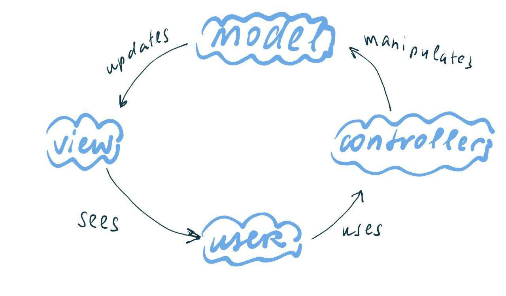
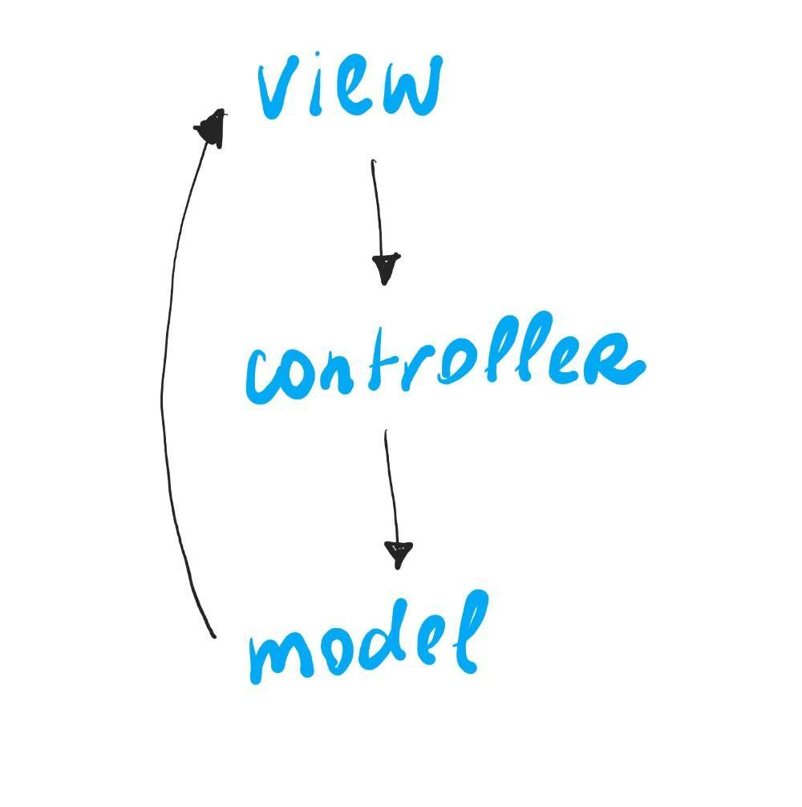
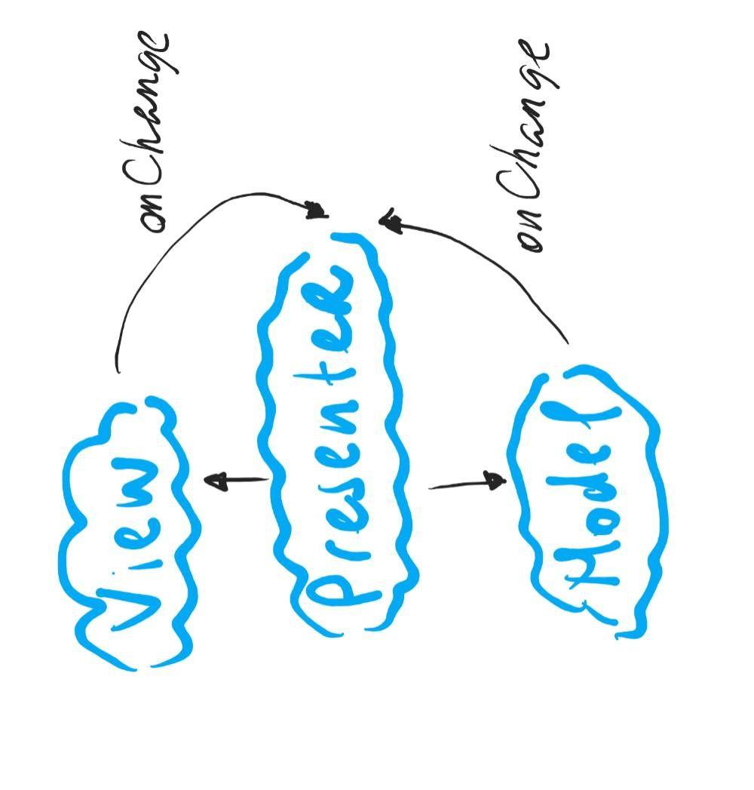
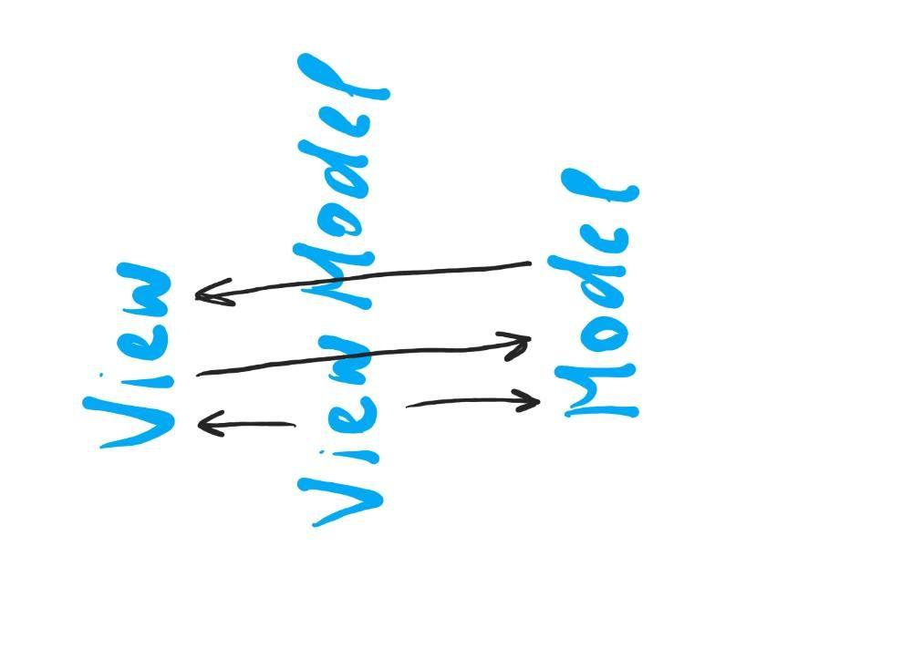

# OOP

- [To content](#readme.md)

## General info
<details>
<summary>Notes</summary>

- programming methodology, based mostly on representing a program as a set of objects, which are instances of some class
- consists of interfaces and relations
- abstract thinking

</details>

## Classes
<details>
<summary>Notes</summary>

- a group of objects or scenes, which have similar signs
- good class
  - describes one entity
  - solves only one task
  - is not a collection of functions for everything
  - uses correctly when needed (ex. when we need several objects with similar behavior and interface, but the state is different)
- good methods
  - one method = one action
  - if method is not called from the outside, make it private

</details>

## Interface
<details>
<summary>Notes</summary>

- describes an object's structure, it's properties and methods (+ arguments and return values), does not describe the realization, only data types.
```
Math.abs: function(number): number;
Math.random: function(): number;
Array.map: function(function(*, number, Array): *): Array;
```
- interface is important to minimize errors and for proper usage
```JavaScript
[1, 2, 3].map(parseInt); // 1, NaN,  NaN
parseInt: function(number, number): number;
```

</details>

## OOP principles
<details>
<summary>Encapsulation</summary>

- in capsula, interfaces, closed realization details

</details>

<details>
<summary>Inheritance</summary>

- one of the ways to use methods and properties from parents in their children
- But Gotchas!
  - do not create long prototypes chains
  - parent max abstract (banana + jungle)
  - if wrong abstract => multiple inheritance problem, works not in all languages
- Inheritance alternatives
  - Composition (react)
  - Delegation
  - Mixins
  - Interfaces (not in JS)
```JavaScript
class GuitarPlayer extends Man {
  constructor(firstName) {
    super(firstName);

    this.guitarCount = 6;
  }
}

// if we're not adding new properties, not necessary to call the constructor
class GuitarPlayer extends Man {
  // reuse parent properties inside the child class
  // this.jump(); also works
  doubleJump() {
    super.jump();
    super.jump();
  }
}
```

</details>

<details>
<summary>Polymorphism</summary>

- (many forms) an ability to use the same identifier (name) for solving alike problems (but different upon realization)
- one interface and many ways or one signature and several interfaces
- overload
```JavaScript
parseInt(42, 10); // float (number)
parseInt('42', 10); // string
parseInt({ name: 'Max', value: 42 }, 10); // NaN
```
- overrides in depths of the prototype chain
- what if w/o polymorphism?
  - naming problem
  - more complex working with code
```JavaScript
class GuitarPlayer extends Man {
  // to override parent method
  jump() {
    console.log('Mega jump!');
  }

  doubleJump() {
    // to use parent method
    super.jump();
    // to use own overridden method
    this.jump();
  }
}
```
- polymorph class almost = interface in TS
```JavaScript
// adding an abstract class
class AbstractMan {
  constructor(firstName) {
    if (new.target === AbstractMan) {
      throw new Error('...');
    }

    this.name = firstName;
  }

  walk() {
    // for the methods needed to be implemented
    throw new Error('...');
  }

  jump() {}
}

const man = new AbstractMan('Tom'); // error
```

</details>

## Data-binding
<details>
<summary>Notes</summary>

- mechanics used to synchronize data and view
- data - information, doesn't depend on view
- view - a part of an interface (UI), doesn't depend on the way of implementation

</details>

<details>
<summary>MV* general info</summary>

- ways to organize business login in an app
- hierarchy
  - model
    - flat structure - all models are at the same level
    - hierarchical structure - there are nested models, frequently the parent models are collections, mostly used for working with large applications
  - view
    - flat - all views init in one controller and work directly with it
    - hierarchical - views are added directly into other views and build their hierarchy independently. Parent views could subscribe to child events and handle it in it's own way
  - controller
    - mega-controller - one big controller for the whole application (or for every screen), which describes all business logic
    - HMVC - the system, where there are many nested controllers, abstractions for higher levels (c list - c elem)
- low coupling
  - model and view must be abstract and should not
    - know about each other
    - export only the abstract interface
  - could not exist without high cohesion. If there are abstract modules, there should be logic, which connects them


</details>

<details>
<summary>MVC</summary>

- Model - data, controls the view
- View - components, low coupling
- Controller - stores the business logic, meets model and view
- Creation
  - controller creates a model
  - controller creates a view
  - controller subscribes view to model changes
  - model and view interact directly with each other
- User interactions
  - user interacts with a view
  - view tells the controller about user actions
  - controller calls model changes
  - model updates the view via subscription
- Load
  - controller calls model update
  - model loads data and tells the view about changes


</details>

<details>
<summary>MVP</summary>

- Model - data only, low coupled component
- View - view only, low coupled component
- Presenter - connects view and model, all the interactions go through presenter
- Creation
  - presenter creates model
  - presenter creates view
  - presenter subscribes to view changes
  - presenter subscribes to model changes
  - presenter directs binding between model and view
  - listens to changes in both and calls the update methods
- User interactions
  - user interacts with a view
  - view tells the presenter about the changes
  - presenter runs the model update logic
  - model tells the presenter about updates
  - presenter updates the view
- Load
  - presenter runs the model update logic
  - model tells the presenter about updates
  - presenter updates the view


</details>

<details>
<summary>MVVM</summary>

- Model - data only
- View - view only
- ViewModel - binds view and model via binder, which describes the connection between model and view
- Creation
  - ViewModel receives the view
  - ViewModel receives the model
  - ViewModel binds view and model vie binding method (some binder)
  - view and model states synchronize automatically
- User interactions
  - view updates model via binding, described in the ViewModel
- Load
  - model after being loaded synchronizes with the view via binding


</details>

<details>
<summary>Pattern Observer</summary>

- the way to bind components so that they tell each other about changes

</details>